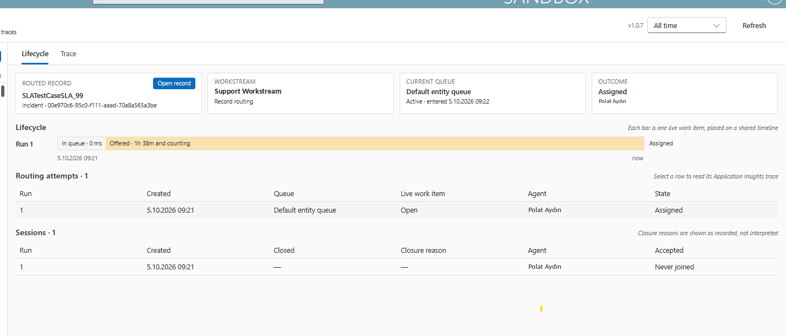
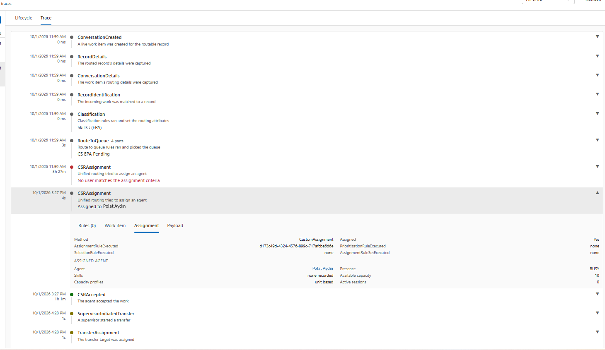

# Routing Diagnostics

A PCF control that explains how Dynamics 365 Customer Service unified routing handled a
record or a conversation: which rules ran, which queue it landed in, who it was offered
to, who accepted it, and why assignment failed when it did.

It replaces the routing diagnostics screen Microsoft retired, and it works for anything
unified routing can route: cases, emails, conversations on any channel, and custom
tables.




## What it shows

**Lifecycle** reads Dataverse directly:

- Every live work item created for the record, numbered as runs on a shared timeline,
  split into time in queue, time offered, and time worked.
- Every session, the agent it was offered to, when they accepted, and the recorded
  closure reason.
- The queue the record sits in now, or nothing when it is no longer queued.

**Trace** reads Application Insights through a request row and a cloud flow, and draws
the routing stages as a timeline: classification, route to queue, each assignment
attempt, acceptance, transfers. Opening a stage shows the rules that ran, the work item
criteria that were matched against, the agent who was picked with their skills, presence
and capacity, and the raw payload.

Ids that the trace logs as bare GUIDs are resolved to names and are clickable: queue,
workstream, skills, agent, assignment rule set.

## How the trace works

The browser cannot query Application Insights, so the control does not try:

1. The control creates a row in `plt_urd_diagnosticrequest` with the conversation id and
   a time window.
2. A Dataverse-triggered cloud flow picks the row up, runs a KQL query against the
   Application Insights resource named by the environment variables, and writes the
   results as `plt_urd_routingdiagnosticevent` rows.
3. The control polls the request row and renders the events once it reaches a terminal
   status.

Requests are cached per routing attempt for the life of the session, so moving between
attempts costs nothing. "Re-run query" asks again on purpose.

A recurring bulk delete job clears old request and event rows.

## Install

1. Import the managed solution from
   [Releases](../../releases).
2. During import, fill the three environment variables:

   | Variable | Value |
   | --- | --- |
   | `routingAppInsightsResourceGroup` | Resource group of the Application Insights resource |
   | `routing_RoutingAppInsightsResourceName` | Name of the Application Insights resource |
   | `routing_AppInsightsSubscriptionId` | Subscription id |

3. Set the two connection references: Dataverse and Azure Monitor Logs. The Azure
   Monitor connection needs read access to that Application Insights resource.
4. Turn on the **Routing Diagnostics - Fetch Events** flow.
5. Add the **Routing diagnostics** custom page to the sitemap of whichever model-driven
   app should host it, then publish that app.

Diagnostics must be switched on for unified routing, otherwise Application Insights has
nothing to read. See
[View diagnostics for unified routing](https://learn.microsoft.com/en-us/dynamics365/customer-service/administer/unified-routing-diagnostics).

## Permissions

Lifecycle reads `msdyn_ocliveworkitem`, `msdyn_ocsession`, `msdyn_sessionparticipant`
and `queueitem`. Name resolution additionally reads `queue`, `systemuser`,
`characteristic`, `bookableresource`, `bookableresourcecharacteristic`,
`msdyn_liveworkstream` and `msdyn_decisionruleset`. A table the user cannot read is not
an error: the id stays on screen as written.

## Build

```powershell
npm install
npm run build
pac pcf push --publisher-prefix plt
```

The control version lives in two places and they are kept in step by hand: `version` in
`RoutingDiagnostics/ControlManifest.Input.xml` and `VERSION` in
`RoutingDiagnostics/components/App.tsx`, which is what the header shows.

A custom page keeps its own copy of an imported code component. After pushing, open the
page in Power Apps Studio, accept the update prompt, save, publish the page, then
publish every model-driven app that references it.

## Licence

MIT. See [LICENSE](LICENSE).